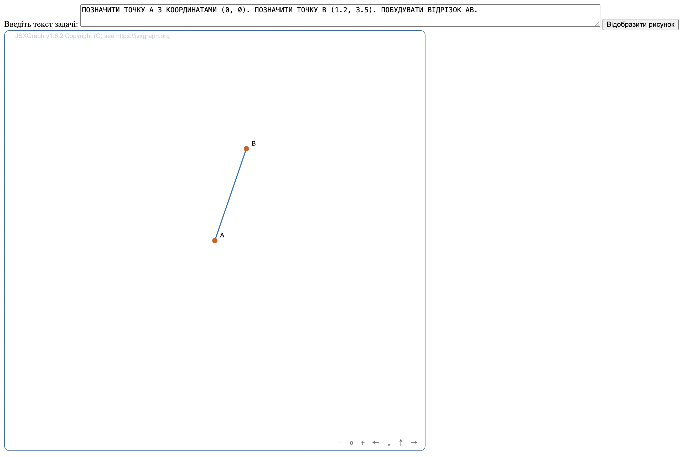
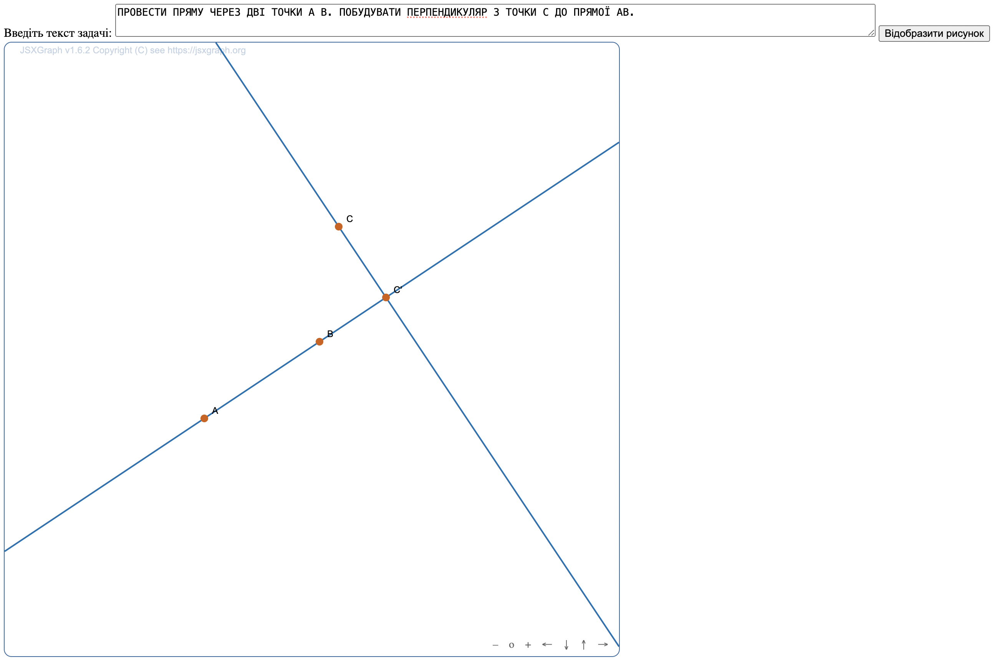
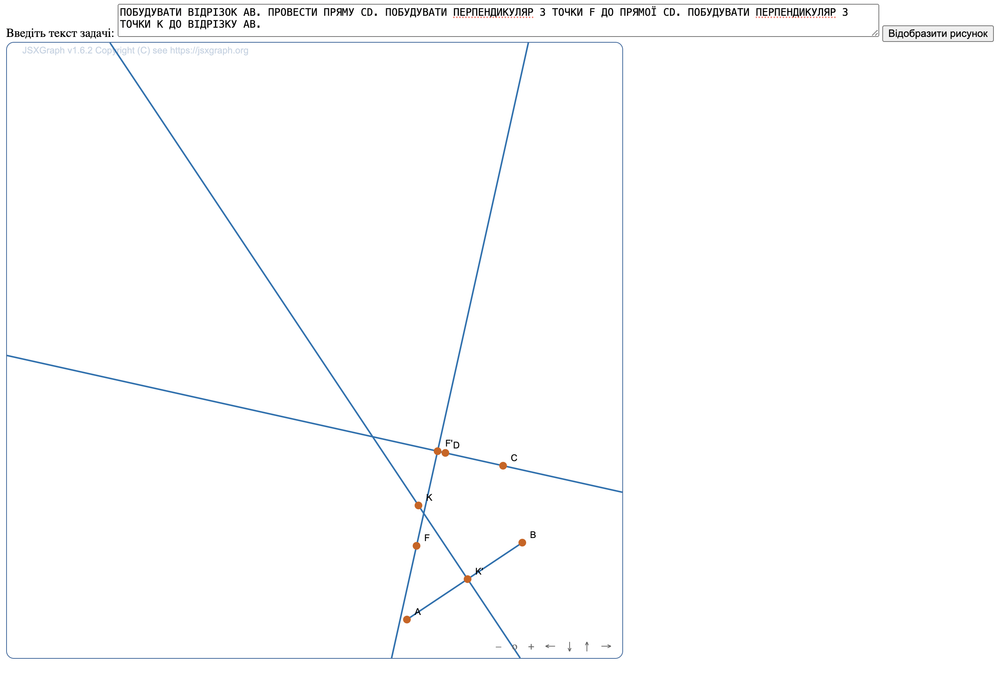
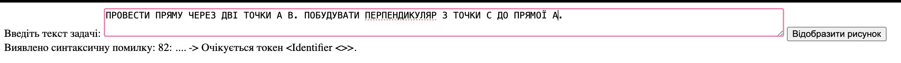
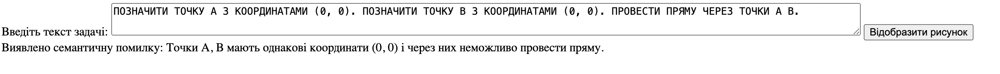

## Приклади задач, які програма зможе накресилити
1) `ПОЗНАЧИТИ ТОЧКУ A З КООРДИНАТАМИ (0, 0). ПОЗНАЧИТИ ТОЧКУ B (1.2, 3.5). ПОБУДУВАТИ ВІДРІЗОК AB.`
2) `ПРОВЕСТИ ПРЯМУ ЧЕРЕЗ ДВІ ТОЧКИ A B. ПОБУДУВАТИ ПЕРПЕНДИКУЛЯР З ТОЧКИ C ДО ПРЯМОЇ AB.`
3) `ПОБУДУВАТИ ВІДРІЗОК AB. ПРОВЕСТИ ПРЯМУ CD. ПОБУДУВАТИ ПЕРПЕНДИКУЛЯР З ТОЧКИ F ДО ПРЯМОЇ CD. ПОБУДУВАТИ ПЕРПЕНДИКУЛЯР З ТОЧКИ K ДО ВІДРІЗКУ AB.`

## Приклади виконання
### Побудова до задачі 1

### Побудова до задачі 2

### Побудова до задачі 3

### Приклад синтаксичної помилки

### Приклад семантичної помилки

