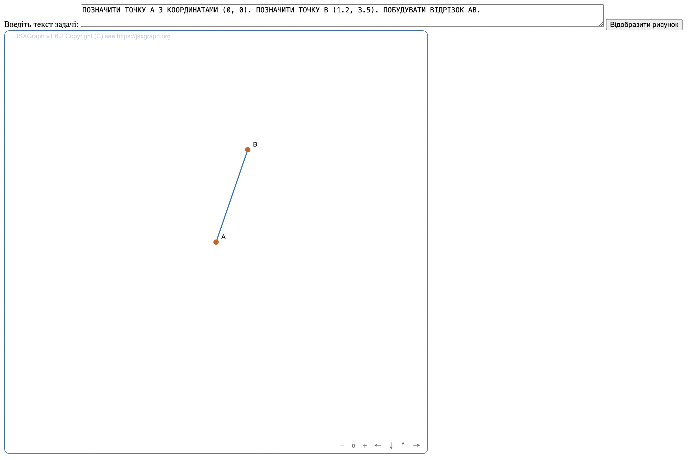
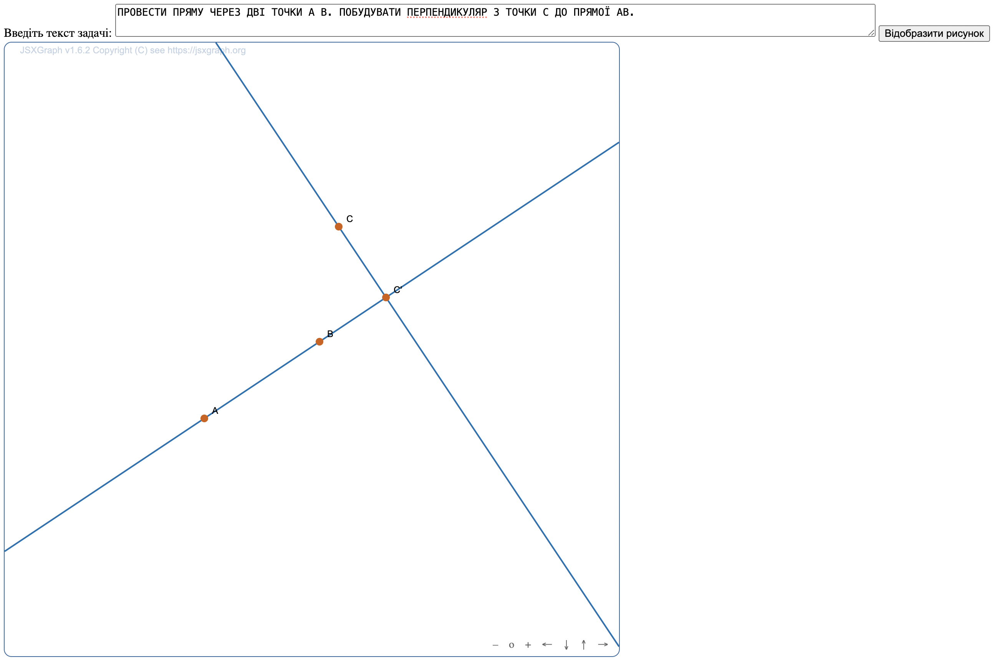
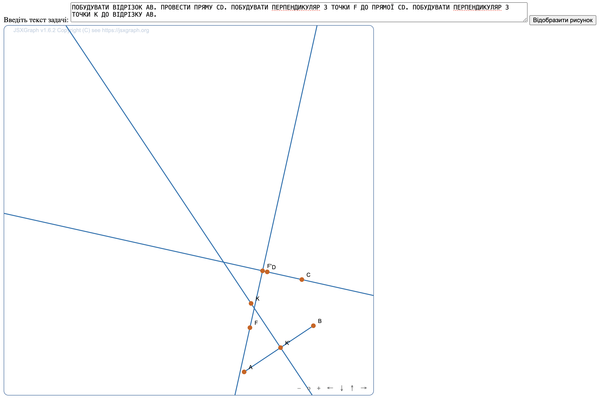
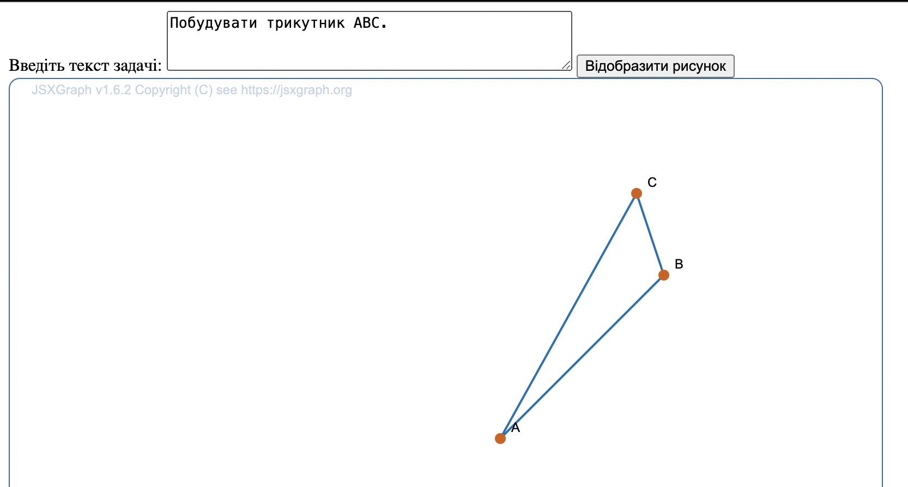
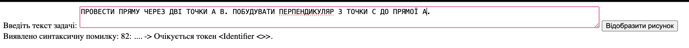
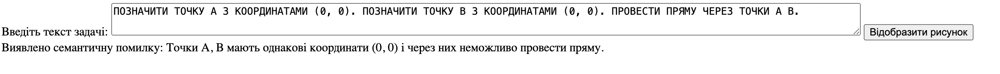

## Приклади задач, які програма зможе накреслити
1) `Позначити точку A з координатами (0, 0). Позначити точку B (1.2, 3.5). Побудувати відрізок AB.`
2) `Провести пряму через дві точки A B. Побудувати перпендикуляр з точки C до прямої AB.`
3) `Побудувати відрізок AB. Провести пряму CD. Побудувати перпендикуляр з точки F до прямої CD. Побудувати перпендикуляр з точки K до відрізку AB.`
4) `Побудувати трикутник ABC.`

## Приклади виконання
### Побудова до задачі 1

### Побудова до задачі 2

### Побудова до задачі 3

### Побудова до задачі 4

### Приклад синтаксичної помилки

### Приклад семантичної помилки

